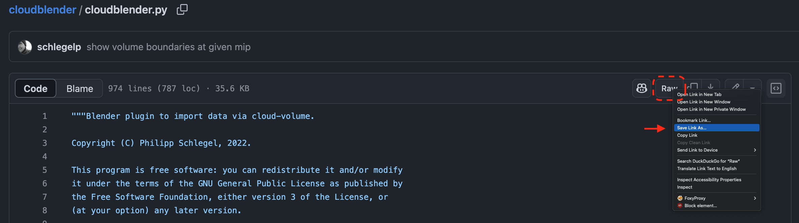

# cloudblender [WIP]
Blender wrapper for [`cloud-volume`](https://github.com/seung-lab/cloud-volume).

The basic idea is to let you import image data, skeletons and meshes from
any data source that `cloud-volume` understands.

- [x] import image data as planes/cubes
- [x] import segmentation data as planes/cubes
- [x] import meshes
- [ ] import skeletons

  

## Installation

### Download `cloublender.py`

For this you have three options:

#### 1. Download the entire repository
Clicking on "Code" -> "Download ZIP" and extract the contents somewhere on your computer.

  

#### 2. Download the `cloudblender.py` file directly

Click on `cloudblender.py` in the file tree above. Then right-click on the Raw button and select "Save link as...".

  

#### 3. Clone the repository

Use either your terminal or a Git client to clone the repository.

### Install the Addon

1. Fire up Blender and navigate to "Edit" -> "Preferences" -> "Add-ons".
2. Click "Install" and select the `cloudblender.py` file you downloaded in the previous step.
3. Make sure to activate the add-on by checking the box next to it (you can search for "cloudblender" in the search bar).

  

### Install `cloud-volume`

When you first run the addon, you will need to install the `cloud-volume` Python package.

Open up the right sidebar in Blender (press `N` if it's not visible) and navigate to the "CloudBlender" tab. If `cloud-volume` is not installed, you will see a button to install it.
Click on it and wait for the installation to complete.

  

Once the installation is complete, the greyed-out buttons will become active, and you can start using the addon.

## Usage

### Connecting to a Data Source
At the beginning of the session, only the "Connect" button is active. Click it to connect to the cloud volume server.

  
  

The prompt will ask you to add a sources for images and segmentation for your dataset. You don't have to provide both, but you need at least one of them.
The default sources point to the [MICrONS dataset](https://ngl.microns-explorer.org/#!gs://microns-static-links/mm3/explore.json).

### Loading Image Data

Currently, you can load image data either as individual planes or as a cube. Overlaying the segmentation data on top of the image data is also supported.

  

The dialog will ask you to specify start and end coordinates for the cube/slices which you can either give in voxels or in world coordinates.

### Updating Image Data (experimental)

Once you imported a slice or a cube*, you can move/scale it within the bounds of the volume. Pressing the "Update images" buttin should update the image data to
match the new position of the slice. Please note that this function is still experimental and may not always work as expected.

*_a cube is just a bunch of slices_

### Loading Neuron Meshes

Meshes for neurons can be loaded by clicking the "Load meshes" button. To load a neuron you must provide its segmentation ID. Multiple IDs can be provided as a comma-separated list.

  

### Coloring Neurons

Clicking the "Color neurons" button will color all loaded neuron meshes according to their segmentation ID. Colors should match the colors used in the segmentation data.